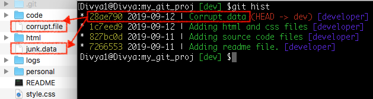
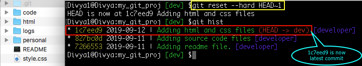

Committed the wrong data

Syntax:
git reset --hard HEAD~n –reset the project to ‘n’ commits before the latest committed snapshot
git reset --hard <commit-id> –reset the project to given commit id snapshot

latest commit that has wrong data- common git mistakes

Command: git reset --hard HEAD~1

The latest commit and the corrupt files are removed from the local repository, staging area as well as the working directory.

Caution: It’s a dangerous command as you end up losing files in the working directory. Not recommended on a remotely shared repository.
