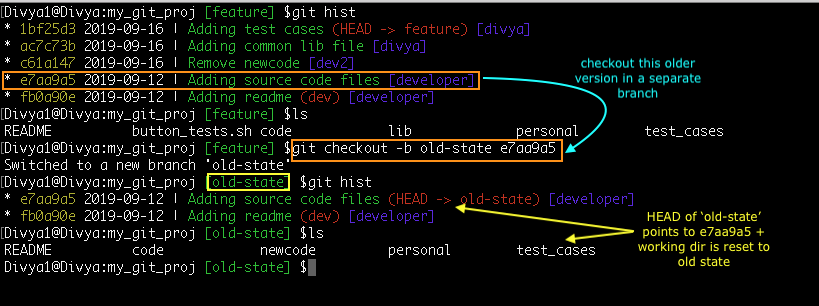

Get back to my old project state

You can jump to an older state of your project in the history of time. If you mess up in the latest version or need enhancements in older code, you may want to create another branch out of that old project snapshot to not hinder with your current work. Let’s see how:
a. List out the project history and decide on the older commit id, command: git hist
b. Create another branch out of the commit id: git checkout -b old-state e7aa9a5
c. Continue working on the code and later merge/rebase with the ‘master’ branch.

