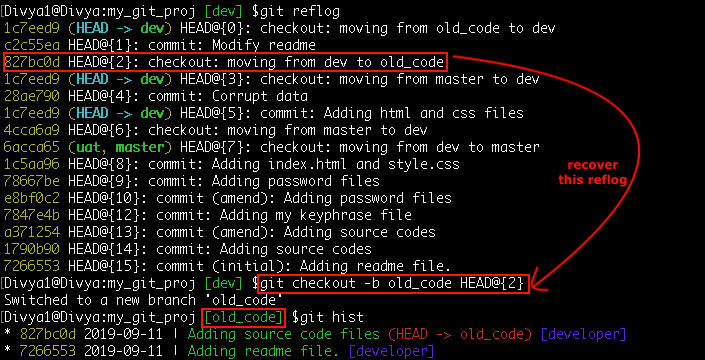

Recover a deleted local branch
It is possible to regenerate the lost work on a reference branch. Say, I deleted
the branch ‘old_code’ without merging with the main branch and lost the work. And no, I did not push the branch to a remote repository either, what then? Well git tracks and keep a journal entry of all the changes done on each reference, let’s see mine: git reflog

So, HEAD@{2} is the pointer when I moved to ‘old_code’ branch, let’s recover that:

Syntax: git checkout -b <branch-name> <commit-id>
Command: git checkout -b old_code HEAD@{2}

You must be now in the ‘old_code’ branch with your latest work at the time of its creation.Additionally, the ‘reflog’ pointer at HEAD@{1} was the recent commit made on the ‘old_code’ branch.To restore this unique commit just run the command as: git reset --hard HEAD@{1}.This also restores the modified files in the working directory.

Ref Tutorial : https://www.edureka.co/blog/common-git-mistakes/
