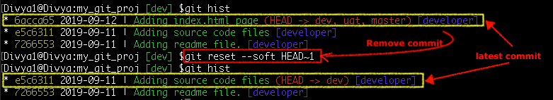
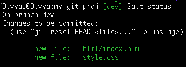
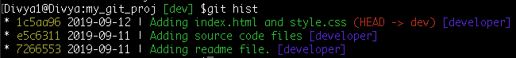

Replace the latest commit with a new commit

Syntax: git reset --soft [ <commit-id>/HEAD~n>]

The ‘–soft’ option just remove the committed files from the local repository while they are still
staged in the Index and you can re-commit them after a review. <commit-id> is the sha-1 of the
snapshot that you want to remove from the local repo. <HEAD~n> where n is the number of commits before the HEAD commit

Command: git reset --soft HEAD~1

Modify files and stage them again

Command: git commit -m 'Adding index.html and style.css'
Your commit history now turns out to be:

Ref Tutorial : https://www.edureka.co/blog/common-git-mistakes/
