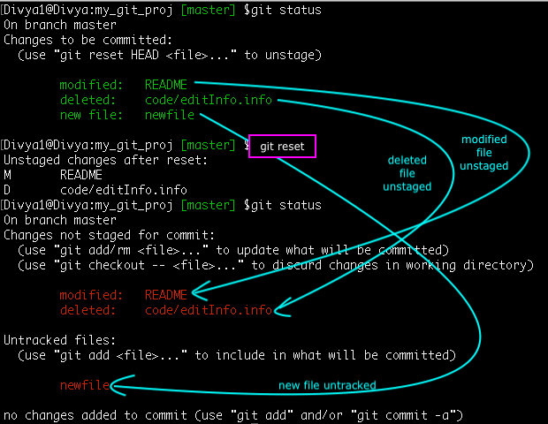

Un-stage files/directories from Index

While adding and/or modifying files you often tend to use the default behavior of ‘git add’ command, which is to add all files and directories to the Index. Many a time you feel the need to un-stage certain files or modify them one last time before committing them.

Syntax: git reset <filename/dirname>
				git reset HEAD <filename/dirname>

Git Log History Format
	git config --global alias.hist 'log --pretty=format:"%C(yellow)%h%Creset %ad | %C(green)%s%Creset%C(red)%d%Creset %C(blue)[%an]" --graph --decorate --date=shortx'

	Ref Tutorial : https://www.edureka.co/blog/common-git-mistakes/
