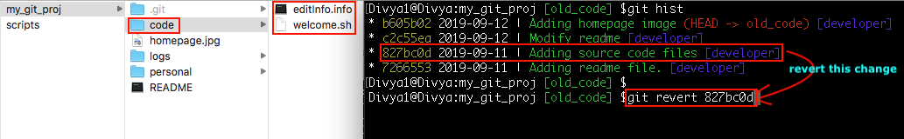
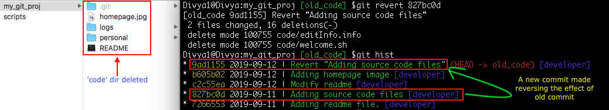

Undo changes done in a commit

git revert is used to record some new commits to reverse the effect of some earlier commits.
Syntax: git revert <commit-id>
From my commits logs, I would like to reverse the change done in the highlighted commit id:

Command: git revert 827bc0d

it is better, that you do not reset ‘–hard’ the shared commits, but instead ‘git revert’ them to preserve the history so that it becomes easier for all to track down the history logs to find out what was reverted, by whom and why?

You can use the same logic of referring the commits concerning the HEAD pointer instead of giving the commit id, as in HEAD~3 or HEAD~4 and so on.
